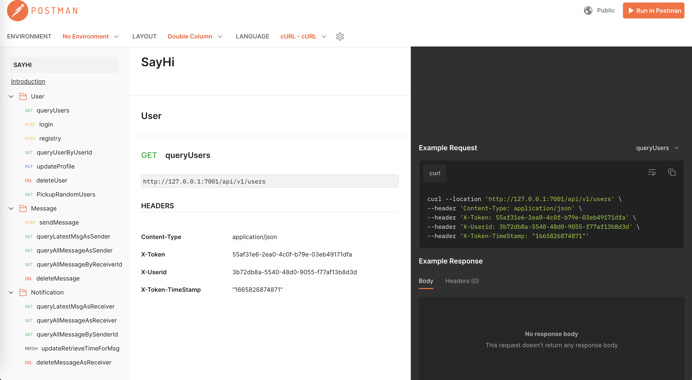
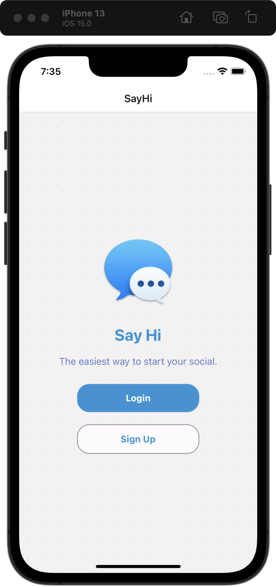
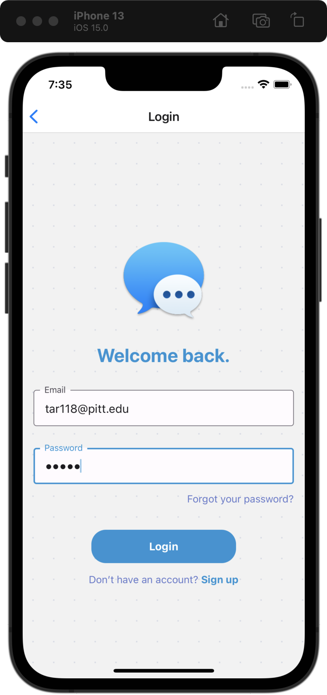
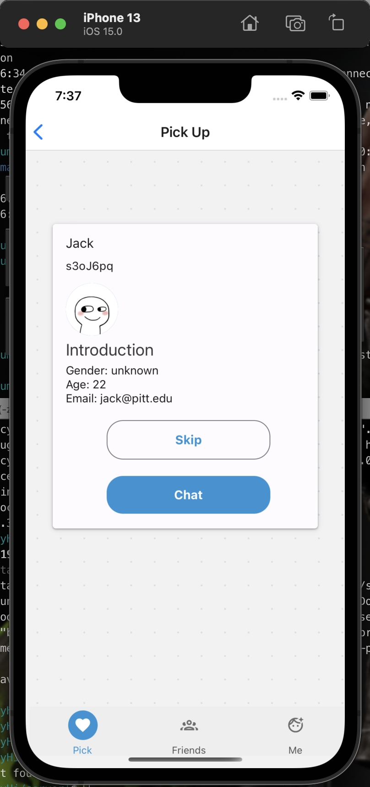
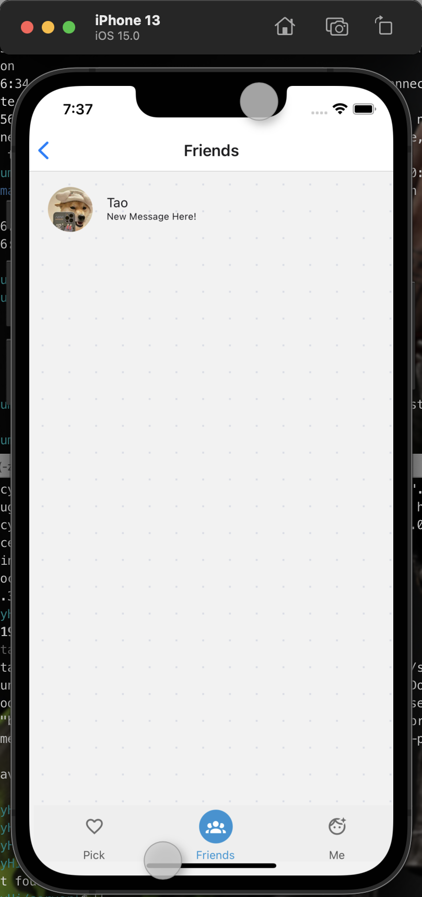
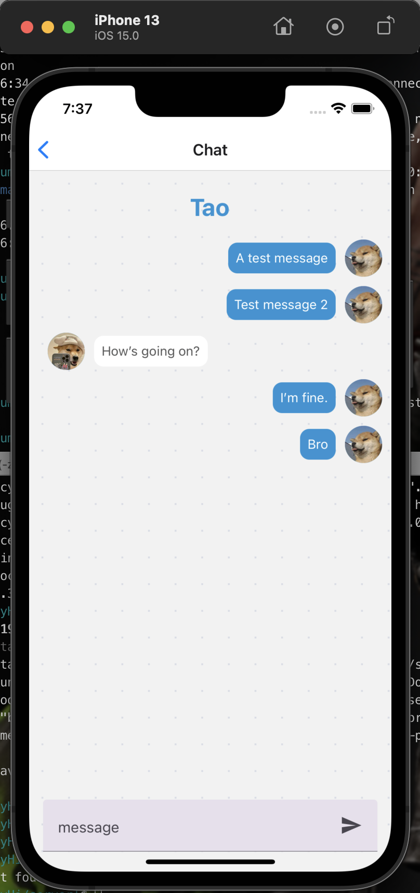
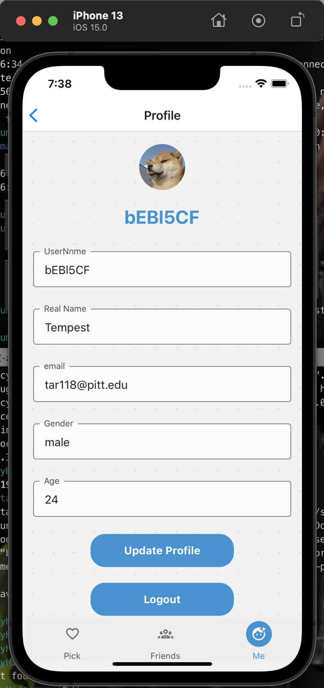

## Chat&Date App
> Author: Tempest(tar118@pitt.edu)
> Profile: https://blog.epicanecdotes.games

This project is a chat & date application which is for Full stack challenge event.

## Frontend Part

[React-Native](https://reactnative.dev/): React Native combines the best parts of native development with React, a best-in-class JavaScript library for building user interfaces. You can use React Native today in your existing Android and iOS projects or you can create a whole new app from scratch.

More Details: see [`/client/README.md`](./client/README.md)

### Features
- [x] sign up
- [x] sign in, logout
- [x] quick sign in (secure save token)
- [x] update user profile
- [x] pick up new friends and chat
- [x] chat with friends
- [x] see history messages
- [x] receive messages
- [x] iOS and Android compatibility based on React Native

## Backend

[Egg.js](https://www.eggjs.org/): Born to build better enterprise frameworks and apps with Node.js & Koa. A Node.js server framework based on Koa.js with numerous middlewares and plug-ins.
[Koa.js](https://koajs.com/): next generation web framework for node.js. Expressive HTTP middleware framework for node.js to make web applications and APIs more enjoyable to write.

More Details: see [`/server/README.md`](/server/README.md)

### Protocol

RESTful API

- users
- messages
- notifications

### Features
- [x] sign up
- [x] sign in
- [x] update user profile
- [x] pick random users
- [x] send a message (add friend)
- [x] retrieve messages by filter
- [x] retrieve latest messages

### Password Encryption

sha256

### Auth

Redis+Token Authorization

## Protocol

RESTful API

API Document: [Postman Workspaces SayHi](https://documenter.getpostman.com/view/4832479/2s847BUwDA)

## Database
> about database deployment & configs, data importing, see more in `server/README.md`

PostgreSQL@15 + Redis  or  MySQL + Redis

database backup: `./sayhi.sql`

## Demo & Video

[demo video](https://drive.google.com/file/d/123rTRYMT-S0hh21lwz1qm9jj594Q_qwD/view?usp=sharing)

## Docker
[TODO]
Time-limited

## Resources References

The logo and splash screen are made by myself using Adobe Express

Other images assets are from Google images.

## Liscence
MIT

